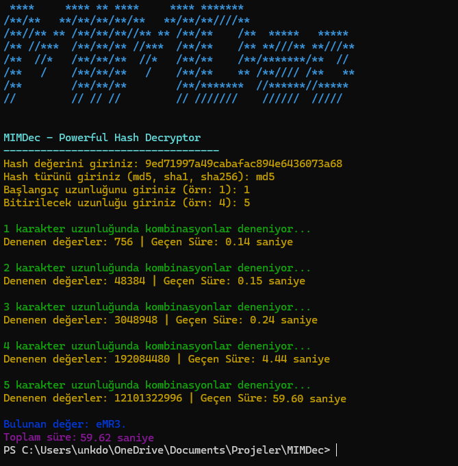

# MIMDec - Hash Decryptor



**MIMDec**, güçlü ve etkili bir brute-force tabanlı hash çözüm aracıdır.  
Desteklenen hash türleriyle şifrelenmiş hash değerlerini çözmeyi hedefler.  


---

## 🎯 **Özellikler**

- **Desteklenen Hash Türleri:** `md5`, `sha1`, `sha256`
- Brute-force ile hızlı ve etkili çözüm
- Renkli terminal çıktıları (Colorama ile)
- Durum güncellemeleri ile anlık bilgi
- Çoklu iş parçacığı (Threading) desteği ile performanslı tarama

---

## 🚀 **Nasıl Kullanılır?**

1. **Programı çalıştırın:**

   ```bash
   python main.py
   ```

2. **Hash değerini girin:**
   - Çözmek istediğiniz hash değerini yazın (örn: `5d41402abc4b2a76b9719d911017c592`).

3. **Hash türünü belirtin:**
   - Desteklenen hash türlerinden birini seçin: `md5`, `sha1`, veya `sha256`.

4. **Başlangıç uzunluğunu belirleyin:**
   - Şifrenin tahmini başlangıç uzunluğunu belirtin (örn: `1`).

5. **Bitirilecek uzunluğunu belirleyin:**
   - Şifrenin tahmini bitiş uzunluğunu belirtin (örn: `4`).

6. **Sonuçları izleyin:**
   - Program denemeleri ve durumları gösterir, şifre çözülene kadar brute-force işlemini sürdürür.

---

## 🛠️ **Gereksinimler**

Bu program Python 3.8+ ile uyumludur. İlgili bağımlılıkları yüklemek için:  

```bash
pip install -r requirements.txt
```

---

## 📄 **Kod Akışı**

- **Paralel Çalışma:** Brute-force işlemi, `ThreadPoolExecutor` ile `ProcessPoolExecutor` çoklu iş parçacığında gerçekleştirilir.
- **İş Gücü Dağılımı:** CPU çekirdek sayısının sınırlı olması durumunda, iş gücü dağılımı için belirlenen toplam işçi sayısını kullanarak daha verimli bir yük dengelemesi gerçekleştirilmiştir.

---

## 📦 **Bağımlılıklar**

- `colorama`: Renkli terminal çıktıları için.
- `concurrent.futures`: Paralel işlem desteği.
- `hashlib`: Hash fonksiyonları.

---

## 💻 **Örnek Kullanım**

```bash
Hash değerini giriniz: 5d41402abc4b2a76b9719d911017c592
Hash türünü giriniz (md5, sha1, sha256): md5
Başlangıç uzunluğunu giriniz (örn: 1): 1
Bitirilecek uzunluğunu giriniz (örn: 4): 5

1 karakter uzunluğunda kombinasyonlar deneniyor...
Bulunan değer: hello
Toplam süre: 2.35 saniye
```

---

## 💵 **BAĞIŞ**

Bu projeye destek olmak için, lütfen bağışlarınızı "TÜRK SİLAHLI KUVVETLERİ" adına yapınız.

### TÜRK SİLAHLI KUVVETLERİ HESAP BİLGİLERİ

#### YURTİÇİ BAĞIŞ İÇİN:

| TL HESAPLARIMIZ                                      | HESAP NUMARASI      | IBAN NUMARASI                             |
|-----------------------------------------------------|---------------------|------------------------------------------|
| T.İŞ BANKASI ÇANKAYA ŞUBESİ                         | 810000              | TR84 0006 4000 0014 2380 8100 00        |
| AKBANK BAŞKENT KURUMSAL ŞUBESİ                      | 8888                | TR59 0004 6008 3288 8000 0088 88        |
| T.C. ZİRAAT BANKASI ANKARA KAMU KURUMSAL ŞUBESİ    | 6031741-5039       | TR07 0001 0017 4506 0317 4150 39        |
| ZİRAAT KATILIM BANKASI A.Ş. KIZILAY ANKARA ŞUBESİ  | 57968-1             | TR13 0020 9000 0005 7968 0000 01        |
| VAKIF KATILIM BANKASI A.Ş. ANKARA ŞUBESİ            | 198700              | TR68 0021 0000 0001 9870 0000 01        |
| GARANTİ BANKASI MALTEPE ŞUBESİ                      | 6297083             | TR71 0006 2000 1140 0006 2970 83        |
| HALK BANKASI ANKARA KURUMSAL ŞUBESİ ()              | 16001987            | TR37 0001 2009 4520 0016 0019 87        |
| HALK BANKASI ANKARA KURUMSAL ŞUBESİ ()              | 16000007            | TR50 0001 2009 4520 0016 0000 07        |
| TEB ANKARA ŞUBESİ                                   | 67198571            | TR13 0003 2000 0000 0067 1985 71        |
| T.VAKIFLAR BANKASI MERKEZ ŞUBE ()                 | 00158007306454209   | TR55 0001 5001 5800 7306 4542 09        |
| T.VAKIFLAR BANKASI MERKEZ ŞUBE ()                 | 00158007296114497   | TR71 0001 5001 5800 7296 1144 97        |

#### YURTDIŞI BAĞIŞ İÇİN:

| USD HESAPLARIMIZ                                     | HESAP NUMARASI      | IBAN NUMARASI                             |
|-----------------------------------------------------|---------------------|------------------------------------------|
| T.İŞ BANKASI ÇANKAYA ŞUBESİ                         | 3910000             | TR85 0006 4000 0024 2383 9100 00        |
| T.C. ZİRAAT BANKASI ANKARA KAMU KURUMSAL ŞUBESİ    | 6031741-5052       | TR44 0001 0017 4506 0317 4150 52        |

| EUR HESAPLARIMIZ                                     | HESAP NUMARASI      | IBAN NUMARASI                             |
|-----------------------------------------------------|---------------------|------------------------------------------|
| T.İŞ BANKASI ÇANKAYA ŞUBESİ                         | 4080000             | TR28 0006 4000 0024 2384 0800 00        |
| T.C. ZİRAAT BANKASI ANKARA KAMU KURUMSAL ŞUBESİ    | 6031741-5065       | TR81 0001 0017 4506 0317 4150 65        |

---

### Lisans
Bu proje açık kaynaklı bir çalışma olup herhangi bir lisansa sahip değildir. Herkesin kullanımına açıktır.
